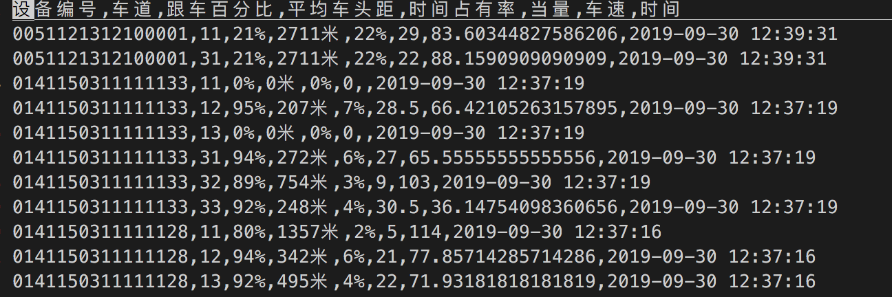

# ASHRAE
## 交调站预测项目代码说明
### 1 原始文件处理
原始文件所有属性中但凡含有中文字符的要全部去掉；
例如：

去掉平均车头距带有的 米，以及时间占有率后面的 %号；
然后使用loadData函数处理，得到是设备号的列表；
 originDataPath是处理后的路径地址
 buildModel()函数是预测多个设备之间值
 buildOneDevices()函数只预测一个设备的值
