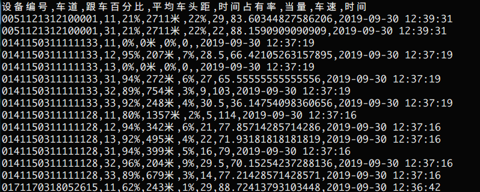

### 交调站预测
原始文件的格式参照之前的格式进行生成

按照设备号训练好的模型存放在model文件夹内
#### 运行的时候先要处理数据，把需要预测的数据按照设备号分成个csv文件来单独预测；
> loadData函数，参数是原始多个设备号混合的csv文件,运行结束后会生成按照设备号命名的单个csv文件

#### 之后遍历每个分割好的csv进行预测
> modelPredict 函数是进行预测的函数，预测结果按照 **设备号_jtresult.csv**格式进行保存。
